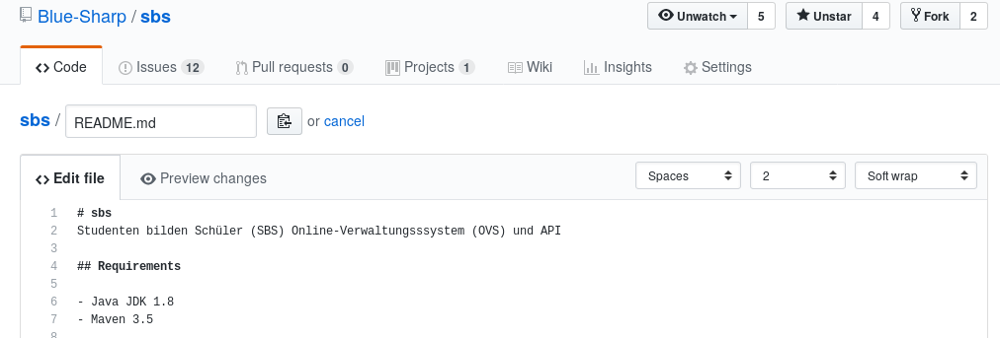

# Revealjs <br> Quickstart <br> <small>by [Knecht](https://knowledge.rootknecht.net/about)</small>

---

# Why <br> Reveal?

---

## Do you know this?

 <!-- .element height="750%" width="75%" -->
<small><[source](http://www.kothuria.com/bad-powerpoint-presentations/bad-powerpoint-presentations-examples-of-bad-powerpoint-presentations-slaved-template/)>

--

## How to diff?

 <!-- .element height="50%" width="50%" -->
<small>Icons made by <a href="http://www.freepik.com" title="Freepik">Freepik</a> from <a href="https://www.flaticon.com/" title="Flaticon">www.flaticon.com</a> is licensed by <a href="http://creativecommons.org/licenses/by/3.0/" title="Creative Commons BY 3.0" target="_blank">CC 3.0 BY</a></small>)

--

## Do you know this?

 <!-- .element height="100%" width="100%" -->

--

## How about that?

 <!-- .element height="100%" width="100%" -->
<small>[source](https://www.planet-source-code.com/vb/2010Redesign/images/LangugeHomePages/HTML5_CSS_JavaScript.png)

--

## Webtechnologies + Documentation <br>= ???

---

# Revealjs

--

## What is that?

* Framework for HTML presentations <!-- .element: class="fragment" -->
* Support for Markdown, orgmode, and more <!-- .element: class="fragment" -->
* Speaker notes, pdf export, API, and more <!-- .element: class="fragment" -->

--

## Syntax

  <!-- .element height="75%" width="75%" -->

<small>[source of this presentation](https://repo.rootknecht.net/open/revealjs-quickstart/)
<small>[extensive example](https://raw.githubusercontent.com/evilz/vscode-reveal/master/sample.md)</small>

--

## Tooling
<!-- .slide: data-background="./background.png" -->
<!-- .slide: style="color:red" -->

* Emacs, VS Code, Vim <!-- .element: class="fragment" -->
* R Studio, Jupyter <!-- .element: class="fragment" -->
* reveal-md, Pandoc <!-- .element: class="fragment" -->
* HTML <!-- .element: class="fragment" -->

--

### Pandoc example

```bash
pandoc -t revealjs -s -o myslides.html myslides.md \
    -V revealjs-url=http://lab.hakim.se/reveal-js
```

--

### Reveal-md example

```bash
npm i -g reveal-md
reveal-md presentation.md --static public
```

--

### Revealjs & Gitlab

---

# Benefits

* VCS, portable, small size
* Easy to write
* Powerful features
* Less is more

---

# Alternatives

* [Impressjs](https://impress.js.org/#/bored)
* [Remark](https://remarkjs.com/)
* [Shower](https://github.com/shower/shower)
* [Latex Beamer](https://de.wikipedia.org/wiki/Beamer_\(LaTeX\))
* [Prezi](https://prezi.com/de/)

---

### Links

* [Revealjs](https://github.com/hakimel/reveal.js)
* [Visual Studio Code](https://marketplace.visualstudio.com/items?itemName=evilz.vscode-reveal)
* [Emacs](https://github.com/yjwen/org-reveal)
* [Pandoc](https://pandoc.org/)
* [reveal-md](https://github.com/webpro/reveal-md)