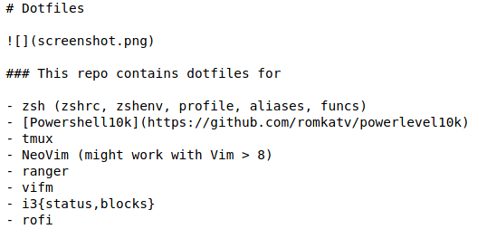
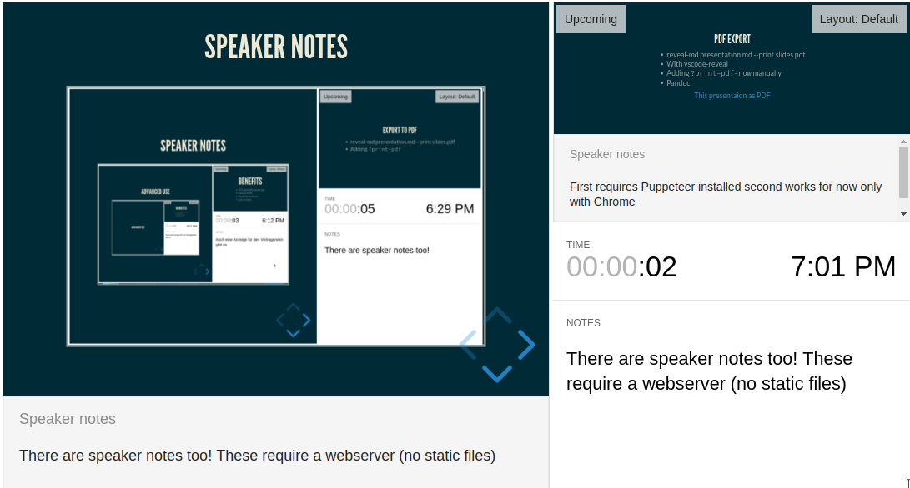

# Do you know this?

{ width=50% height=50% }

<small><small>[source](http://www.kothuria.com/bad-powerpoint-presentations/bad-powerpoint-presentations-examples-of-bad-powerpoint-presentations-slaved-template/)</small></small>

# How to diff?

{ width=40% height=40% }

<small><small>Icon made by <a href="http://www.freepik.com" title="Freepik">Freepik</a> from <a href="https://www.flaticon.com/" title="Flaticon">www.flaticon.com</a> is licensed by <a href="http://creativecommons.org/licenses/by/3.0/" title="Creative Commons BY 3.0" target="_blank">CC 3.0 BY</a></small></small>

# Do you know this?

{ width=100% height=100% }

# How about that?

{ width=80% height=80% }

<small><small>[source](https://www.planet-source-code.com/vb/2010Redesign/images/LangugeHomePages/HTML5_CSS_JavaScript.png)</small></small>

# Webtechnologies + Markup Language = ???

# REVEALJS

::: incremental

* Framework for HTML presentations
* Support for Markdown, orgmode, rST, and more
* Speaker notes, pdf export, API, and more

:::

# Syntax

{ width=50% height=50% }

<small>[source of this presentation](https://raw.githubusercontent.com/Allaman/reveal-js-intro/master/presentation.md) and a slightly more [extensive example](https://raw.githubusercontent.com/evilz/vscode-reveal/master/sample.md)</small>

# Tooling {data-background-image="./background.png"}

## Many tools {style="color:yellow"}

::: incremental

* Emacs, VS Code, Vim
* R Studio, Jupyter
* reveal-md Pandoc
* HTML
* Many more

:::

## Pandoc

```bash
pandoc -t revealjs -s -o slides.html myslides.md \
    -V revealjs-url=http://lab.hakim.se/reveal-js
```

::: notes

Does require internet access as reveljs libs will be loaded from the web

:::

## Reveal-md

```bash
npm i -g reveal-md
reveal-md presentation.md --static public
reveal-md presentation.md
```

::: notes

 First exports static html files, second spins up local webserver

:::

## VS Code Extension

{ width=45% height=45% }

## Revealjs Workflow

1. Markdown editing
1. Create a standalone HTML file with [Pandoc](https://pandoc.org/)
1. Push it to your [Webserver|Github Pages|S3|...]
1. ... Or automate it via pipeline

# Speaker Notes

{ width=80% height=80% }

::: notes

There are speaker notes too! These require a webserver (no static files)

:::

# PDF Export

* reveal-md presentation.md --print slides.pdf
* With vscode-reveal
* Adding `?print-pdf-now` manually to URL
* Pandoc

::: notes

First requires Puppeteer installed,second works for now only with Chrome

:::

# Benefits

* VCS, portable, small size
* Easy to write
* Powerful features
* Less is more

# To be considered

* No diagrams ootb
* Image sizing/alignment tricky
* Additional export
* Basic HTML knowledge required
* Browser compatibility
* Syntax depends on "build" tool

# Alternatives

* [Impressjs](https://impress.js.org/#/bored)
* [Remark](https://remarkjs.com/)
* [Shower](https://github.com/shower/shower)
* [Latex Beamer](https://de.wikipedia.org/wiki/Beamer_(LaTeX))
* [Prezi](https://prezi.com/de/)

# Links

* [Revealjs](https://github.com/hakimel/reveal.js)
* [Visual Studio Code](https://marketplace.visualstudio.com/items?itemName=evilz.vscode-reveal)
* [Emacs](https://github.com/yjwen/org-reveal)
* [Pandoc](https://pandoc.org/)
* [reveal-md](https://github.com/webpro/reveal-md)
* [Gitlab Pages](https://docs.gitlab.com/ee/user/project/pages/)

# Thanks!
