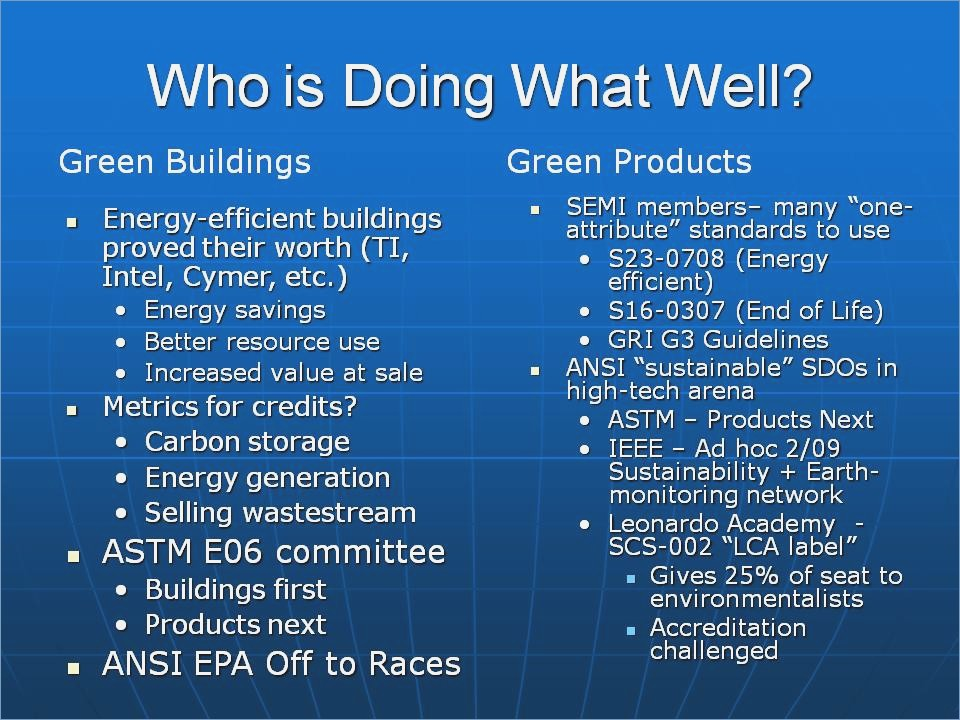

# Revealjs   Quickstart

---

# Why   Reveal?

---

## Do you know this?

 <!-- .element height="750%" width="75%" -->

BAD! <!-- .element: class="fragment" -->
--

## How to diff?

 <!-- .element height="50%" width="50%" -->

EVEN WORSE! <!-- .element: class="fragment" -->

--

## Do you know this?

 <!-- .element height="100%" width="100%" -->

N1CE! <!-- .element: class="fragment" -->

--

## How about that?

 <!-- .element height="100%" width="100%" -->

SURE! <!-- .element: class="fragment" -->

--

## Webtechnologies + Documentation  = ???

---

# Revealjs

--

## What is that?

* Framework for HTML presentations <!-- .element: class="fragment" -->
* Markdown, orgmode, and more <!-- .element: class="fragment" -->
* Speaker notes, pdf export, API, and more <!-- .element: class="fragment" -->

--

## Syntax

BILD vom editor

<small>[Source example](https://raw.githubusercontent.com/evilz/vscode-reveal/master/sample.md)</small>

--

## Tooling

* Emacs, VS Code, Vim <!-- .element: class="fragment" -->
* R Studio, Jupyter <!-- .element: class="fragment" -->
* reveal-md, pandoc <!-- .element: class="fragment" -->
* HTML <!-- .element: class="fragment" -->

---

# Benefits

* Text files &rarr; VCS, portable
* Easy but powerful
* Less bullet points

---

### Links

* [Revealjs](https://github.com/hakimel/reveal.js)
* [Visual Studio Code](https://marketplace.visualstudio.com/items?itemName=evilz.vscode-reveal)
* [Emacs](https://github.com/yjwen/org-reveal)
