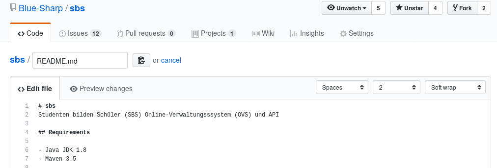

# Revealjs <br> Quickstart <br> <small>by [Knecht](https://knowledge.rootknecht.net/about)</small>

---

# Why <br> Reveal?

---

## Do you know this?

 <!-- .element height="750%" width="75%" -->

--

## How to diff?

 <!-- .element height="50%" width="50%" -->

--

## Do you know this?

 <!-- .element height="100%" width="100%" -->

--

## How about that?

 <!-- .element height="100%" width="100%" -->

--

## Webtechnologies + Documentation <br>= ???

---

# Revealjs

--

## What is that?

* Framework for HTML presentations <!-- .element: class="fragment" -->
* Support for Markdown, orgmode, and more <!-- .element: class="fragment" -->
* Speaker notes, pdf export, API, and more <!-- .element: class="fragment" -->

--

## Syntax

  <!-- .element height="75%" width="75%" -->

<small>[extensive example](https://raw.githubusercontent.com/evilz/vscode-reveal/master/sample.md)</small>

--

## Tooling
<!-- .slide: data-background="background.png" -->
<!-- .slide: style="color:red" -->

* Emacs, VS Code, Vim <!-- .element: class="fragment" -->
* R Studio, Jupyter <!-- .element: class="fragment" -->
* reveal-md, Pandoc <!-- .element: class="fragment" -->
* HTML <!-- .element: class="fragment" -->

--

### Create single file presentation
```bash
pandoc -t revealjs -s -o myslides.html myslides.md -V revealjs-url=http://lab.hakim.se/reveal-js
```

---

# Benefits

* VCS, portable, small size
* Easy to write
* Powerful features
* Less is more


---

### Links

* [Revealjs](https://github.com/hakimel/reveal.js)
* [Visual Studio Code](https://marketplace.visualstudio.com/items?itemName=evilz.vscode-reveal)
* [Emacs](https://github.com/yjwen/org-reveal)
* [Pandoc](https://pandoc.org/)
* [reveal-md](https://github.com/webpro/reveal-md)